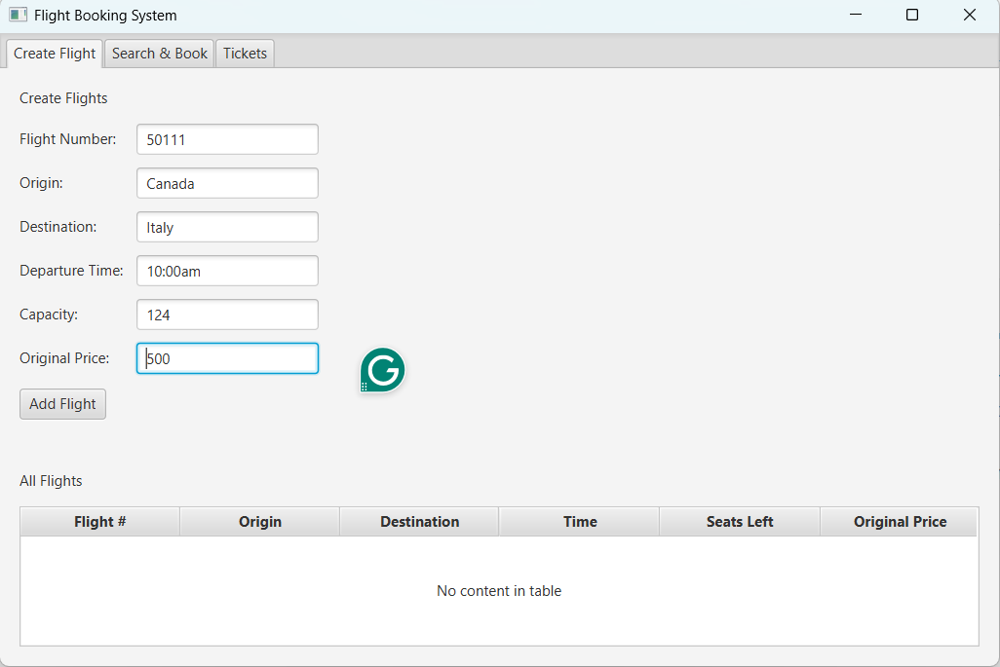
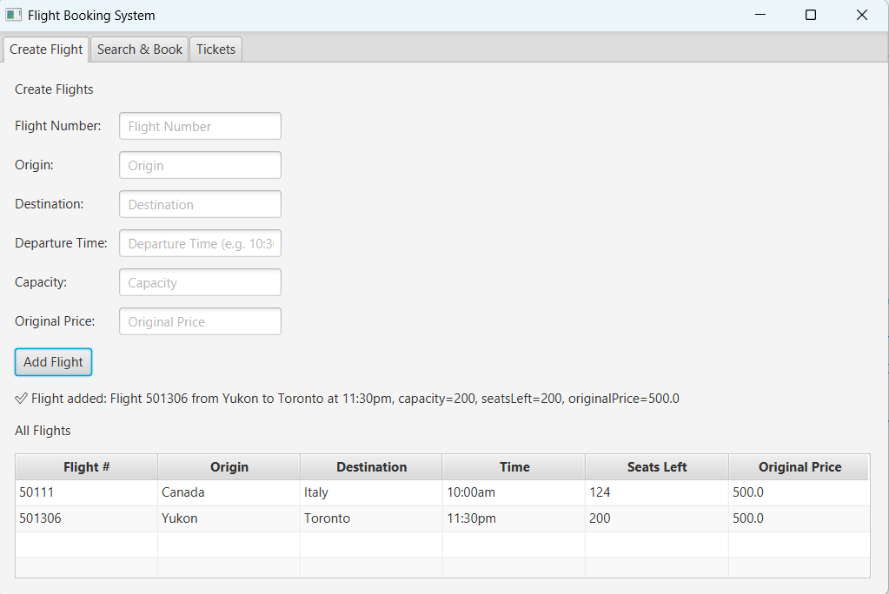

#  Flight Booking System (JavaFX)
# Flight Booking System (JavaFX)

A JavaFX desktop application that simulates a real-world flight booking platform, allowing users to create flights, search routes, and book seats with dynamic ticket pricing based on passenger type.

This project demonstrates object-oriented design, GUI development, and event-driven programming in Java.

---

##  User Interface Overview

### 1. Create Flight Interface

**What it does:**
- Admin or user can add a new flight.
- Inputs:
  - Flight Number
  - Origin
  - Destination
  - Departure Time
  - Capacity
  - Original Price
- Clicking **Add Flight** adds the flight to the system and displays it in the table.

**Purpose:**
- Builds the list of available flights that users can later search and book.

---

### 2. Booking Flight Interface

**What it does:**
- Allows users to enter passenger details:
  - Name
  - Age
  - Membership type
  - Years of membership (if applicable)
- Calculates ticket price based on passenger type.
- Clicking **Book Seat** reserves a seat on the selected flight.

**Purpose:**
- Handles ticket creation and seat reservation logic.

---

### 3. View Available Flights Interface

**What it does:**
- Users search flights by:
  - Origin
  - Destination
- Shows matching flights in a table.

**Purpose:**
- Helps users find flights before booking.

---

### 4. Book Seat Confirmation

**What it does:**
- Displays confirmation message after successful booking.
- Shows:
  - Passenger info
  - Flight details
  - Ticket price

**Purpose:**
- Confirms that booking was successful and seat count updated.

---

## ⚙️ Program Structure

### Main Components

- **Flight**
  - Stores flight data (number, origin, destination, time, capacity, price)
- **Passenger**
  - Stores passenger information and membership status
- **Ticket**
  - Links passenger to flight and calculates final price
- **Controller / MainApp**
  - Handles GUI actions and connects UI with backend logic

---

##  Concepts Used

- Object-Oriented Programming (OOP)
- JavaFX GUI
- Event handling
- Collections (lists of flights and tickets)
- Input validation
- Dynamic table updates

---

##  How to Run

1. Open project in NetBeans
2. Ensure JavaFX is properly configured
3. Run `MainApp.java`

---

##  Future Improvements

- Save data to file or database
- Login system
- Seat selection map
- Admin dashboard

---

**Author:** Ghulam Mustafa Syed  
**Program:** Computer Engineering – TMU
